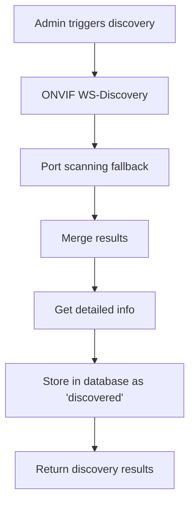
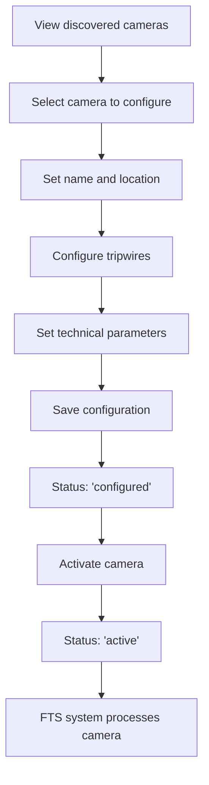
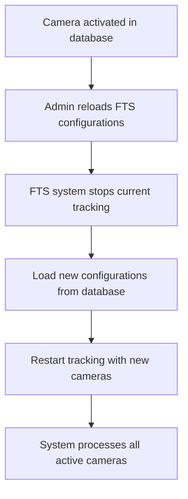

# Camera Management Solution

## Problem Overview

The system previously suffered from a fundamental design flaw where the core Face Tracking System (FTS) used hardcoded, in-memory camera configurations while the FastAPI backend used a PostgreSQL database for camera management. This created two separate sources of truth, leading to:

- **Data Duplication**: Camera configurations existed in both database and hardcoded lists
- **Configuration Mismatch**: API-managed cameras were ignored by the FTS system
- **Data Loss**: In-memory configurations were lost on restart
- **Operational Inefficiency**: Manual camera configuration was error-prone and didn't scale

## Solution Architecture

### 1. Database-Centric Design

The solution establishes the PostgreSQL database as the single source of truth for all camera configurations. The system now includes:

#### Enhanced Database Models

**CameraConfig Table** (`backend/db/db_models.py`):
```python
class CameraConfig(Base):
    __tablename__ = 'camera_configs'
    
    # Core identification
    id = Column(Integer, primary_key=True, index=True)
    camera_id = Column(Integer, unique=True, nullable=False)
    camera_name = Column(String, nullable=False)
    camera_type = Column(String, default='entry')  # 'entry', 'exit', 'general'
    
    # Network configuration
    ip_address = Column(String, nullable=True)
    stream_url = Column(String, nullable=True)
    username = Column(String, nullable=True)
    password = Column(String, nullable=True)
    
    # Technical specifications
    resolution_width = Column(Integer, default=1920)
    resolution_height = Column(Integer, default=1080)
    fps = Column(Integer, default=30)
    gpu_id = Column(Integer, default=0)
    
    # Status and metadata
    status = Column(String, default='discovered')  # 'discovered', 'configured', 'active', 'inactive'
    is_active = Column(Boolean, default=False)
    location_description = Column(String, nullable=True)
    manufacturer = Column(String, nullable=True)
    model = Column(String, nullable=True)
    firmware_version = Column(String, nullable=True)
    onvif_supported = Column(Boolean, default=False)
    
    # Relationships
    tripwires = relationship("Tripwire", back_populates="camera", cascade="all, delete-orphan")
```

**Tripwire Table** (`backend/db/db_models.py`):
```python
class Tripwire(Base):
    __tablename__ = 'tripwires'
    
    id = Column(Integer, primary_key=True, index=True)
    camera_id = Column(Integer, ForeignKey('camera_configs.camera_id'), nullable=False)
    name = Column(String, nullable=False)
    position = Column(Float, nullable=False)  # 0.0 to 1.0
    spacing = Column(Float, default=0.01)
    direction = Column(String, nullable=False)  # 'horizontal', 'vertical'
    detection_type = Column(String, default='entry')  # 'entry', 'exit', 'counting'
    is_active = Column(Boolean, default=True)
    
    # Relationships
    camera = relationship("CameraConfig", back_populates="tripwires")
```

### 2. ONVIF Camera Discovery

**Discovery System** (`backend/utils/camera_discovery.py`):

The system implements comprehensive camera discovery using:

- **ONVIF WS-Discovery**: Multicast discovery for ONVIF-compliant cameras
- **Port Scanning**: Fallback discovery for non-ONVIF cameras
- **Manufacturer Detection**: Identifies camera brands and models
- **Stream URL Discovery**: Automatically finds RTSP/HTTP stream endpoints

```python
class ONVIFCameraDiscovery:
    async def discover_cameras(self, network_range: str = "192.168.1.0/24") -> List[CameraInfo]:
        # ONVIF WS-Discovery
        onvif_cameras = await self._discover_onvif_cameras()
        
        # Port scanning fallback
        port_scan_cameras = await self._discover_via_port_scan(network_range)
        
        # Merge and get detailed information
        all_cameras = self._merge_camera_lists(onvif_cameras, port_scan_cameras)
        detailed_cameras = await self._get_camera_details(all_cameras)
        
        return detailed_cameras
```

### 3. Configuration Management API

**Camera Management Router** (`backend/app/routers/cameras.py`):

Comprehensive API endpoints for camera lifecycle management:

#### Discovery Endpoints
- `POST /cameras/discover` - Network camera discovery
- `GET /cameras/` - List all cameras with filtering
- `GET /cameras/{camera_id}` - Get specific camera details

#### Configuration Endpoints
- `POST /cameras/` - Create new camera configuration
- `PUT /cameras/{camera_id}` - Update camera configuration
- `POST /cameras/{camera_id}/configure` - Configure discovered camera with tripwires
- `POST /cameras/{camera_id}/activate` - Activate/deactivate camera
- `DELETE /cameras/{camera_id}` - Delete camera configuration

#### Tripwire Management
- `POST /cameras/{camera_id}/tripwires` - Create tripwire
- `GET /cameras/{camera_id}/tripwires` - List camera tripwires
- `PUT /cameras/tripwires/{tripwire_id}` - Update tripwire
- `DELETE /cameras/tripwires/{tripwire_id}` - Delete tripwire

#### System Integration
- `POST /cameras/reload-configurations` - Reload FTS configurations from database

### 4. FTS System Integration

**Configuration Loader** (`backend/utils/camera_config_loader.py`):

Bridge between database and FTS system:

```python
class CameraConfigLoader:
    def load_active_cameras(self) -> List[CameraConfig]:
        """Load all active camera configurations from database"""
        db_cameras = self.db_manager.get_active_cameras()
        
        camera_configs = []
        for db_camera in db_cameras:
            camera_config = self._convert_db_camera_to_fts_config(db_camera)
            if camera_config:
                camera_configs.append(camera_config)
        
        return camera_configs
```

**FTS System Refactoring** (`backend/core/fts_system.py`):

The FTS system now:
- Loads configurations from database on startup
- Supports dynamic configuration reloading
- Handles multiple camera sources (ID, IP, stream URL)
- Maintains backward compatibility with existing tripwire logic

```python
def load_camera_configurations() -> List[CameraConfig]:
    """Load camera configurations from the database"""
    try:
        db_camera_configs = load_active_camera_configs()
        
        cameras = []
        for db_config in db_camera_configs:
            # Convert database config to FTS config
            camera_config = CameraConfig(
                camera_id=db_config.camera_id,
                gpu_id=db_config.gpu_id,
                camera_type=db_config.camera_type,
                tripwires=converted_tripwires,
                resolution=db_config.resolution,
                fps=db_config.fps
            )
            
            # Add network configuration
            camera_config.stream_url = db_config.stream_url
            camera_config.ip_address = db_config.ip_address
            camera_config.username = db_config.username
            camera_config.password = db_config.password
            
            cameras.append(camera_config)
        
        return cameras
    except Exception as e:
        # Fallback to default configuration
        return default_cameras
```

## Workflow Implementation

### 1. Camera Discovery Workflow



**API Usage:**
```bash
# Discover cameras on network
curl -X POST "http://localhost:8000/cameras/discover" \
  -H "Authorization: Bearer <super_admin_token>" \
  -H "Content-Type: application/json" \
  -d '{"network_range": "192.168.1.0/24", "timeout": 10}'
```

### 2. Camera Configuration Workflow



**API Usage:**
```bash
# Configure discovered camera
curl -X POST "http://localhost:8000/cameras/1/configure" \
  -H "Authorization: Bearer <super_admin_token>" \
  -H "Content-Type: application/json" \
  -d '{
    "camera_name": "Main Entrance",
    "camera_type": "entry",
    "location_description": "Building main entrance",
    "stream_url": "rtsp://192.168.1.100:554/stream1",
    "username": "admin",
    "password": "password",
    "resolution_width": 1920,
    "resolution_height": 1080,
    "fps": 30,
    "gpu_id": 0,
    "tripwires": [
      {
        "name": "EntryDetection",
        "position": 0.5,
        "spacing": 0.01,
        "direction": "horizontal",
        "detection_type": "entry"
      }
    ]
  }'

# Activate camera
curl -X POST "http://localhost:8000/cameras/1/activate" \
  -H "Authorization: Bearer <super_admin_token>" \
  -H "Content-Type: application/json" \
  -d '{"is_active": true}'
```

### 3. System Integration Workflow



**API Usage:**
```bash
# Reload configurations in FTS system
curl -X POST "http://localhost:8000/cameras/reload-configurations" \
  -H "Authorization: Bearer <super_admin_token>"
```

## Key Benefits

### 1. Single Source of Truth
- All camera configurations stored in PostgreSQL database
- FTS system loads configurations from database
- No more hardcoded configurations
- Consistent data across all system components

### 2. Automated Discovery
- ONVIF-based network scanning
- Automatic camera detection and cataloging
- Reduced manual configuration effort
- Support for various camera manufacturers

### 3. Scalable Management
- RESTful API for all camera operations
- Role-based access control (Super Admin only)
- Bulk operations support
- Real-time configuration updates

### 4. Operational Efficiency
- Web-based camera management interface
- Automatic stream URL discovery
- Validation and error handling
- Comprehensive logging and monitoring

### 5. System Reliability
- Graceful fallback to default configurations
- Configuration validation
- Database transaction safety
- Hot-reload capability without system restart

## Migration Strategy

### 1. Database Migration
```sql
-- Create new tables
CREATE TABLE camera_configs (
    id SERIAL PRIMARY KEY,
    camera_id INTEGER UNIQUE NOT NULL,
    camera_name VARCHAR NOT NULL,
    -- ... other fields
);

CREATE TABLE tripwires (
    id SERIAL PRIMARY KEY,
    camera_id INTEGER REFERENCES camera_configs(camera_id),
    name VARCHAR NOT NULL,
    -- ... other fields
);
```

### 2. Data Migration
```python
# Migrate existing hardcoded cameras to database
def migrate_hardcoded_cameras():
    db_manager = DatabaseManager()
    
    # Convert hardcoded CAMERAS to database entries
    for camera in HARDCODED_CAMERAS:
        camera_data = {
            'camera_id': camera.camera_id,
            'camera_name': f'Camera {camera.camera_id}',
            'camera_type': camera.camera_type,
            'resolution_width': camera.resolution[0],
            'resolution_height': camera.resolution[1],
            'fps': camera.fps,
            'gpu_id': camera.gpu_id,
            'status': 'active',
            'is_active': True
        }
        
        db_camera = db_manager.create_camera(camera_data)
        
        # Create tripwires
        for tripwire in camera.tripwires:
            tripwire_data = {
                'name': tripwire.name,
                'position': tripwire.position,
                'spacing': tripwire.spacing,
                'direction': tripwire.direction,
                'detection_type': 'entry'
            }
            db_manager.create_tripwire(db_camera.camera_id, tripwire_data)
```

### 3. System Deployment
1. Deploy database schema updates
2. Run data migration scripts
3. Deploy updated FTS system
4. Deploy camera management API
5. Test discovery and configuration workflows
6. Remove hardcoded configurations

## Testing Strategy

### 1. Unit Tests
- Database operations (CRUD)
- Configuration loading/validation
- Camera discovery functions
- API endpoint functionality

### 2. Integration Tests
- End-to-end discovery workflow
- Configuration management workflow
- FTS system integration
- Database-to-FTS configuration loading

### 3. System Tests
- Multi-camera discovery
- Network scanning performance
- Configuration reload under load
- Failover scenarios

## Security Considerations

### 1. Access Control
- Super Admin only for camera management
- API authentication required
- Role-based permissions

### 2. Network Security
- Camera credentials stored securely
- HTTPS for all API communications
- Network scanning rate limiting

### 3. Data Protection
- Camera passwords encrypted in database
- Audit logging for all changes
- Input validation and sanitization

## Performance Optimization

### 1. Discovery Performance
- Parallel network scanning
- Configurable timeout settings
- Efficient camera identification

### 2. Database Performance
- Indexed camera_id fields
- Optimized queries for active cameras
- Connection pooling

### 3. System Performance
- Hot-reload without full restart
- Minimal FTS system downtime
- Background processing for discovery

## Monitoring and Maintenance

### 1. Health Monitoring
- Camera status tracking
- Stream health monitoring
- Database connection monitoring

### 2. Logging
- Discovery operation logs
- Configuration change logs
- Error tracking and alerts

### 3. Maintenance
- Regular database cleanup
- Configuration validation
- Performance monitoring

This solution completely resolves the core system inconsistency by establishing the database as the single source of truth while providing a user-friendly, scalable camera management system with automated discovery capabilities.